# 外文资料翻译：自动化内容审核提升用户对社区准则的遵守程度

译文出处：Proceedings of the ACM Web Conference 2023，ACM，2023 年，2666-2676 页  
原文题目：Automated Content Moderation Increases Adherence to Community Guidelines  
作者：Manoel Horta Ribeiro，Justin Cheng，Robert West  
原文 DOI：10.1145/3543507.3583275  
原文存档：`original/horta-ribeiro-cheng-west-2023-automated-content-moderation-arxiv.pdf`

## 题目

自动化内容审核提升用户对社区准则的遵守程度

## 关键词

内容审核；在线平台；社区准则；自动化审核；风险评分；评论删除；评论隐藏；模糊回归不连续设计

## 摘要

在线社交媒体平台会使用自动化审核系统，删除违反规则的内容，或者降低这类内容的可见性。以往研究已经说明人工内容审核的重要性，但自动化内容审核对用户后续行为的影响仍然缺少充分认识。本文基于 Facebook 评论的大规模数据集，共约 4.12 亿条评论，使用模糊回归不连续设计，衡量自动化内容审核对后续违规行为和用户参与行为的影响。前者通过后续被隐藏或删除的评论数量来观察，后者通过后续新增评论数量来观察。

研究发现，在较短的讨论串中，删除评论会减少后续违规行为，即使对没有直接受到处理的其他参与者也会产生影响。这说明删除干预可能阻止讨论继续偏离社区规则。进一步看，对被处理用户而言，删除评论对降低后续违规行为的影响比对降低一般评论活动的影响更持久，说明用户更可能减少违规表达，而不一定长期停止参与讨论。相比之下，仅隐藏内容的影响较小，且统计上不显著。总体而言，研究结果表明，自动化内容审核可以提高用户对社区准则的遵守程度。

## 1 前言

许多在线平台使用自动化内容审核系统执行社区准则。当用户行为违反平台规则时，系统会检测并进行干预。这类系统通常通过删除违规内容或降低违规内容的可见性来减少伤害，例如减少能够看到这类内容的用户数量。不过，内容删除和可见性降低也可能影响平台内的用户行为。审核干预可能让用户更加遵守社区准则，例如被删除的评论可能避免一场讨论失控；也可能产生反效果，例如被处罚用户认为处理决定不公平，从而出现更多违规行为。

理解自动化内容审核对用户行为的因果影响，对于评价系统有效性以及改进系统设计非常重要。但这一问题很难直接通过随机实验来测量。若通过 A/B 测试让一部分用户不受审核，就意味着平台有意保留可能伤害他人的内容；恶意用户还可能利用实验随机性发布有害内容。因此，研究需要在真实平台数据中寻找更合适的准实验条件。

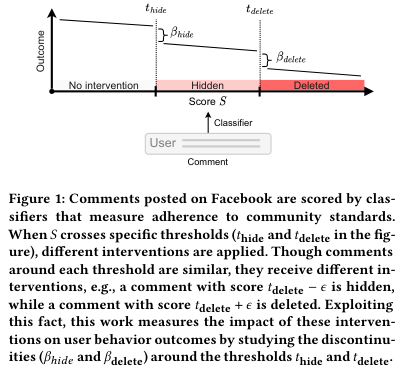

以往研究已经大量讨论人工内容审核在在线社区中的作用，即由志愿者或管理员发现并移除违反社区准则的内容。一些研究也估计了人工审核对社区行为的影响，认为人工审核能够改善用户行为。然而，这些结论不一定能够直接推广到平台级、自动化的审核系统。已有内容审核研究也常以描述性分析为主，而不是因果分析；一些适用于人工审核场景的准实验设计，也不容易直接用于自动化审核。例如，有研究利用人工管理员处理违规内容所需时间的随机性来估计审核影响，但自动化系统通常在内容创建后立即处理，因此这种方法并不适用。

本文研究 Facebook 评论中与“暴力和煽动”社区准则有关的自动化执行机制，采用图 1 所示的准实验方法，观察自动化审核对用户行为的影响。研究分别从两个层面展开：一是用户层面，即观察被处理用户之后是否继续产生违规内容以及是否继续发表评论；二是讨论串层面，即观察含有被处理评论的讨论串中，其他后续评论是否继续出现违规。

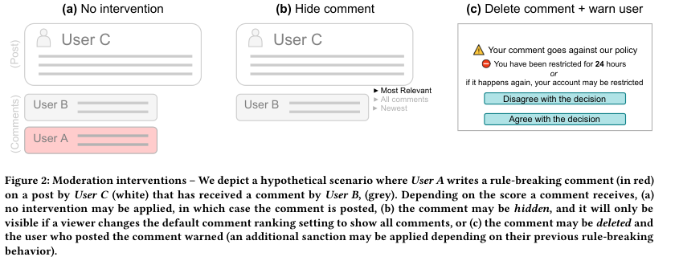

本文分析了两类干预：隐藏和删除。图 2 展示了三种可能情况：不干预时，评论正常显示；隐藏时，评论不会出现在默认评论排序中，只有用户切换到全部评论等视图时才可能看到；删除时，评论被移除，发布者会收到警告，若有历史违规还可能受到额外限制。

研究使用模糊回归不连续设计估计审核干预的因果影响。这种方法利用了自动化审核系统中的两个常见设计。第一，许多平台会用机器学习模型为每条内容分配一个分数 S，表示该内容违反社区准则的可能性。第二，当这个分数高到超过预设阈值 t，并且满足其他条件时，平台会自动隐藏或删除内容。接近阈值两侧的评论往往相似，但刚好超过阈值的一侧更可能被处理。本文正是利用这一点，把阈值附近的样本近似看作随机对照，从而估计处理效果。

总体结果显示，删除评论会减少该评论所在讨论串后续的违规行为，也会减少被删除评论用户后续的违规行为。在讨论串层面，对于干预前评论数不超过 20 条的短讨论串，删除违规评论显著降低了后续违规行为，即使排除原违规用户之后，其他参与者的违规也有所减少。对于超过 20 条评论的长讨论串，该效果不显著。在用户层面，删除会降低后续违规行为和发言活动，但违规行为下降的效果持续更久，而发言活动下降会随时间减弱。也就是说，用户逐渐恢复发帖和评论频率，但更少发布后来会被隐藏或删除的内容。相较之下，隐藏内容在用户层面和讨论串层面的影响都较小，且统计上不显著。

本文的含义在于，目前 Facebook 使用的自动化删除机制能够减少后续违反社区准则的内容生成。这种效果可能来自两个方面：被删除评论的用户之后更少继续发布违规内容；同一讨论串中的其他用户也更少继续发布违规评论。以往研究证明人工内容审核可以减少违规行为，本文则说明这种作用也可能存在于大型平台中的自动化审核系统。虽然本文只能测量分类器阈值附近触发干预的影响，但它说明自动化审核系统除了用准确率、召回率评价之外，也可以从后续用户行为的角度进行评价。

## 2 相关工作

本文建立在两个研究方向之上：反社会行为研究和内容审核研究。

### 2.1 反社会行为

社交媒体早期就已经存在反社会行为。由于这类行为会对用户现实生活造成负面影响，已有大量研究从不同平台、语言和语境中刻画其表现形式。一类研究利用机器学习模型检测网络欺凌、仇恨言论、恶意引战和在线骚扰。许多常用分类器会生成分数，用于判断什么时候应当进行干预。例如，Google Perspective 的主要分类器会为短文本输出“毒性”分数，用来表示一条评论是否粗鲁、不尊重他人或不合常理，并可能使他人离开讨论。该分数已经被用于主动干预潜在违规内容，例如开放评论平台 Coral 在一百多家新闻编辑室中被使用，其中包括 Washington Post 和 Der Spiegel。

不过，虽然检测不良行为的分类器已经存在，关于这些系统实际影响的研究仍然较少。已有研究指出，这类系统可能难以处理上下文差异和方言差异。也就是说，一个模型是否能识别违规内容，与它在真实社区中是否能改善用户行为，是两个不同问题。

另一个相关方向研究反社会行为是否具有“传染性”，即用户在看到恶意、粗鲁或违规内容之后，是否更可能发布类似内容。已有结论并不一致：有研究发现违规行为会从一条评论传播到另一条评论，也有研究未发现明显效果。本文通过观察真实平台中删除或隐藏违规内容之后其他用户的行为，进一步检验这一问题。

### 2.2 内容审核

以往关于内容审核的大多数研究集中在社区层面，即由社区成员执行处罚，例如 Wikipedia 中由选举产生的管理员进行治理。这与平台层面的审核不同，后者通常由集中化的系统或平台代理决定处理方式。已有研究从定量或定性角度描述在线社区的审核实践和治理机制。例如，有研究发现 Reddit 上某些规范具有普遍性，另一些规范则只存在于特定子版块中。

与本文更接近的是评估内容审核效果的研究。在社区层面，有研究测量了 Reddit 上移除内容的效果，也有研究分析了为移除行为提供解释是否能减少后续违规，结果发现二者都能降低之后的违规行为。还有研究考察 Twitch 的聊天模式、Facebook 小组的帖子审批等主动审核工具能否预防反社会行为。也有研究使用清晰回归不连续设计分析 Wikipedia 中算法标记的影响，认为它可以带来更公平的平台结果，但不同语言版本之间效果存在差异。

在平台层面，已有研究还分析了较温和的治理策略，例如把新闻标记为虚假信息，以及把用户或社区从主流平台移除的影响。这些研究说明，平台治理动作会改变用户和社区行为，但其场景、干预方式和自动化程度都与本文不同。

### 2.3 本文与已有研究的关系

已有工作常以描述性方式研究在线审核，或关注人工、社区导向的审核场景。相比之下，大规模平台级自动化审核对用户行为的影响仍然了解不足，而这类自动化审核已经承担了主流社交平台中相当一部分干预工作。因此，本文希望推进对内容审核效果的理解，说明部署在大型社交网络中的自动化系统是否以及如何影响用户行为。

此外，本文也有助于理解违规行为是否会扩散。过去相关研究多依赖实验室环境来观察违规内容或有毒内容对后续评论的影响。本文则在真实社交媒体平台中观察删除或隐藏违规内容对其他用户的影响，因此具有更强的生态有效性。

本文并不是第一篇用准实验方法评估审核干预的研究，但其他研究中的方法不能直接用于本文场景。例如，有的方法假定干预是确定发生的，另一些方法依赖干预发生时间存在随机间隔。本文提出的模糊回归不连续方法更适合自动化审核系统，也可以被调整后用于评估其他自动审核机制对后续用户行为的影响。

## 3 背景

### 3.1 暴力与煽动政策

本文研究的是帮助执行 Facebook“暴力和煽动”社区准则的分类器及相关干预。该政策的基本出发点是，平台希望防止 Facebook 内容可能引发的线下伤害。平台理解人们有时会以威胁或呼吁暴力的方式表达厌恶或不同意见，但会移除煽动或促成严重暴力的语言。

### 3.2 干预方式

本文研究两种用于处理违规内容的干预，它们以递进方式执行。若内容分数高于第一个阈值 t_hide，内容会被隐藏。若分数继续超过第二个阈值 t_delete，内容会被立即删除，并向违规用户发送警告。对其他用户而言，平台不会显示“曾经有一条评论被发布后又删除”的提示。该方式的目标是对内容进行递进式干预：对接近规则边界的内容，可以允许其保留在社交网络中，但降低其可见性。

### 3.3 研究范围

本文研究的暴力与煽动分类器只是 Facebook 确保相关内容遵守社区准则的机制之一。平台还存在其他机制来执行该类准则，也会执行其他社区准则，例如仇恨言论规则。这些内容不在本文研究范围内。

## 4 材料与方法

本文通过两个准实验研究自动执行社区准则的效果。文中将 post 定义为 Facebook 上发布的一条内容，将 comment 定义为对该内容的回复，将 thread 定义为围绕某个 post 形成的一组评论。

### 4.1 数据

两个准实验都使用美国成年用户在 2022 年 6 月 1 日至 8 月 31 日期间发布的英文公开帖子和评论。数据包括约 4.12 亿条评论、150 万个帖子和 130 万名不同用户。所有数据均经过去标识化处理，并以汇总方式分析，研究者不查看个人层面的可识别数据。

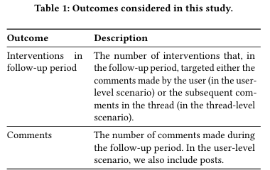

### 4.2 讨论串层面

第一个场景研究自动审核对被处理评论所在讨论串的影响。对数据中的每个帖子，研究者寻找第一条评论 c0，其得分位于隐藏阈值或删除阈值上下 5 个百分点范围内，即 S 属于 `[t_hide - 0.05, t_hide + 0.05]` 或 `[t_delete - 0.05, t_delete + 0.05]`。若某个讨论串中没有满足条件的评论，该讨论串就不进入分析。后续估计时，研究者会根据样本距离阈值的远近重新加权。

对每条被选中的评论 c0，研究者把同一讨论串中 c0 之前的评论视作分配前时期，把 c0 之后的评论视作后续时期。研究者使用后续时期的数据计算结果变量，再通过模糊回归不连续设计估计隐藏或删除 c0 的效果。为了分析效果异质性，研究设置了四种情况：是否把 c0 作者后续发布的其他评论计入结果，以及是否只考虑干预前评论数不超过 20 条的讨论串。选择 20 作为分界，是因为它大致形成 80/20 的数据划分，即约 80% 的讨论串评论数少于 20 条。使用 75/25 或 85/15 的划分也得到相似结论。

### 4.3 用户层面

第二个场景研究自动审核对被处理用户的影响。对数据中的每名用户 u，研究者寻找研究期内第一条得分位于隐藏或删除阈值上下 5 个百分点范围内的评论 c0。若用户没有满足条件的评论，则排除在该分析之外。

对每个被选中的用户-评论元组 `(u0, c0)`，研究者额外观察该用户在 c0 发布前 k 天和发布后 k 天内的所有评论。发布前 k 天为分配前时期，发布后 k 天为后续时期。结果变量同样使用后续时期的数据计算，并使用模糊回归不连续设计估计干预效果。本文从两个方面分析异质性：第一，改变后续时期长度 k，取 7、14、21、28 天；第二，区分近期没有违反过社区准则、删除后只收到警告的用户，以及近期已经有一次违规、删除后会被暂停发布 24 小时的用户。

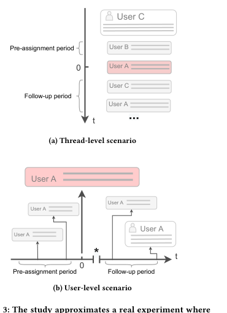

### 4.4 结果变量

表 1 展示了本文观察的结果变量。第一个变量与后续违规行为有关，即后续时期发生的审核干预次数。在用户层面，它表示针对该用户评论的后续干预次数；在讨论串层面，它表示同一讨论串中后续评论受到干预的次数。第二个变量与平台活跃度有关，即后续时期发布的评论数量；在用户层面，还包括帖子数量。

### 4.5 回归不连续设计

回归不连续设计是一种社会科学中常用的准实验研究设计。本文使用的是其扩展形式，即模糊回归不连续设计。设每条评论 c 都被赋予一个分数 `S_c`，范围为 `[0, 1]`；再设 `X_c` 为指示变量，若内容受到干预则为 1，否则为 0。当分数超过某个阈值 t 时，该评论受到干预的概率会明显上升。可以写作：

```text
P[X_c = 1 | S_c] = f1(S_c), if S_c >= t
P[X_c = 1 | S_c] = f0(S_c), if S_c <  t
且 f1(a) > f0(a)
```

这比清晰回归不连续设计更适合本文场景。清晰设计要求阈值以下一定不处理、阈值以上一定处理，但真实平台中并非如此。阈值以下的评论可能因用户举报被删除，阈值以上的评论也可能因其他自动系统判断而没有被删除。因此，干预概率在阈值处发生跳跃，但不是从 0 跳到 1。

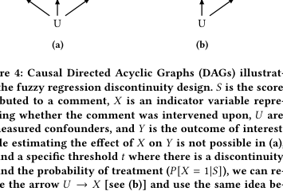

图 4 展示了因果关系。得分 S 会影响是否受到处理 X，X 又影响研究者关心的结果 Y。但还存在未观测混杂因素 U。模糊回归不连续设计的关键思想是，在阈值 t 附近，分数刚低于阈值和刚高于阈值的评论可以被认为非常相似，区别主要在于高于阈值的评论更可能受到处理。因此，在阈值附近，可以把得分是否越过阈值看作一种工具变量，用来估计处理 X 对结果 Y 的局部平均处理效应。

文中将该效应表示为 `LATE = ITT / ITT_d`。其中，`ITT` 是被分配到处理组对结果的平均影响，`ITT_d` 是被分配到处理组后真正受到处理的比例。由于本文只在阈值附近估计效果，又把它写为阈值处的局部平均处理效应 `LATEC`：

```text
LATEC =
( E[Y_c | S_c = t + epsilon] - E[Y_c | S_c = t - epsilon] )
/
( E[X_c | S_c = t + epsilon] - E[X_c | S_c = t - epsilon] )
```

实际估计时，研究者使用两阶段最小二乘回归。第一阶段用分数 S 预测处理 X，第二阶段用第一阶段预测出的处理值估计结果 Y。由于数据不可能无限接近阈值，研究者需要在偏差和方差之间权衡：阈值附近窗口越宽，样本越多但混杂因素影响越大；窗口越窄，样本越少，估计方差越大。

为处理这一问题，本文使用局部线性回归，并采用三角核加权。距离阈值越近的评论权重越高，距离越远的评论权重越低。核带宽 h 控制偏差和方差之间的平衡，研究者根据均方误差最优原则选择带宽。

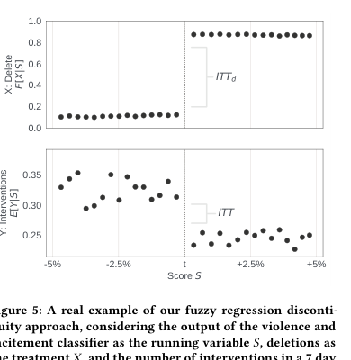

图 5 展示了一个实际例子。样本为此前没有违反社区准则的用户，结果变量为第一条关注评论发布后 7 天内受到的干预次数。上图展示评论得分与删除处理概率之间的关系，下图展示评论得分与后续干预次数之间的关系。直观地说，模糊回归不连续设计就是用结果变量在阈值处的跳跃，除以处理概率在同一阈值处的跳跃，从而估计删除处理对后续行为的影响。

### 4.6 稳健性检验概述

为确保回归不连续设计有效，研究者进行了多项稳健性检验，包括视觉检查、阈值操纵检验、安慰剂 FRD 检验和带宽变化检验。详细结果见附录 A。

## 5 结果

研究者使用模糊回归不连续设计，分别估计隐藏和删除在讨论串层面与用户层面的影响。图 6 展示了主要标准化效果，表 2 展示了所有估计结果。

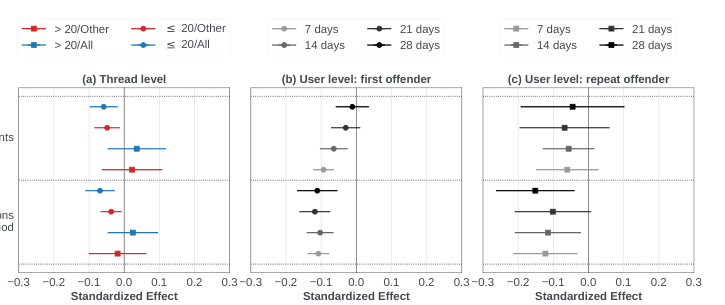

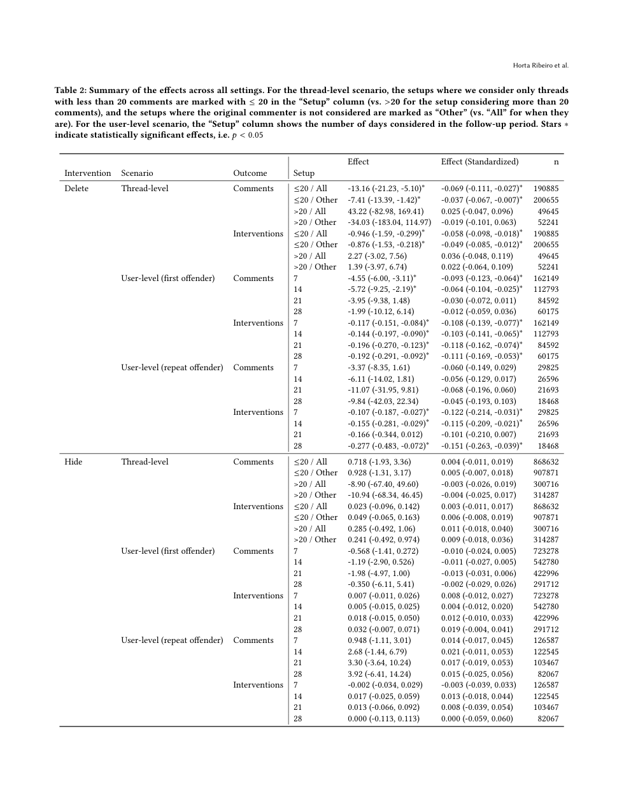

### 5.1 讨论串层面

图 6(a) 展示了删除评论在讨论串层面对后续评论数量和后续干预次数的标准化影响。对于干预前评论数少于或等于 20 条的讨论串，删除评论对两个结果变量都有显著影响。当把原评论作者的后续评论也纳入统计时，删除使后续评论数量减少 13.16 条，95% 置信区间为 -21.23 到 -5.10；后续干预次数减少 0.946 次，95% 置信区间为 -1.59 到 -0.299。为了理解这一效果大小，研究者计算了删除阈值下方附近讨论串的平均情况：这些讨论串平均在后续时期收到 1.5 次干预，平均有 27.7 条评论。因此，上述变化幅度并不小。

对于干预前已经超过 20 条评论的讨论串，删除效果无论对后续评论数量还是后续干预次数都不显著。这可能有两个原因。第一，在更长的讨论串中，删除单条评论的影响更弱，因为其他参与者不一定看到该评论，或者讨论串中已有大量其他评论。第二，超过 20 条评论的讨论串样本更少，效果更难被稳定观察到。

隐藏评论与删除不同。对于所有讨论串层面的设置，隐藏对后续干预次数和评论数量的影响都较小，且统计上不显著。

研究者还排除了原违规用户的后续评论，重新计算讨论串的结果变量，以判断影响究竟来自原违规用户的行为改变，还是来自讨论串中其他用户的行为改变。在少于或等于 20 条评论的讨论串中，标准化效果仍然保持相似。例如，把所有用户纳入时，评论数量减少 0.069 个标准差；只看其他用户时，减少 0.037 个标准差。这说明删除干预不仅影响原评论作者，也可能让其他用户减少发布违规评论。

### 5.2 用户层面

用户层面分析区分了两类用户。第一类是此前没有被删除过评论的首次违规者，他们在删除后只收到警告。第二类是重复违规者，他们除了收到处理外，还会被暂停发布权限 24 小时。研究者在计算后续时期时不把暂停期计入，以免把“无法发言”误认为行为改变。

对于首次违规者，图 6(b) 显示删除评论对后续评论数量和后续干预次数都有显著影响。以干预后 7 天为例，删除使评论数量减少 4.55 条，使后续干预次数减少 0.117 次。阈值下方附近的用户在后续时期平均收到 0.23 次干预，平均发布 13 条评论，因此这一效果具有实际意义。进一步看，随着后续观察期扩大到 21 天和 28 天，删除对评论数量的影响逐渐减弱，但对后续干预次数的降低作用大体稳定。这说明自动化内容审核对减少后续违规行为具有较持久的积极影响，而对一般发言活动的抑制是暂时的。隐藏评论对首次违规者的后续干预和评论数量影响较小，且不显著。

对于重复违规者，图 6(c) 显示删除评论同样减少了后续干预次数和评论数量。不过，这一组的置信区间更宽，部分原因是样本更小，因为第二次被删除评论的用户数量更少。在 7、14、28 天三个观察窗口内，后续干预次数的下降具有显著效果，且量级与首次违规者相近。以 28 天窗口为例，删除使重复违规者后续收到的干预减少 0.277 次，95% 置信区间为 -0.483 到 -0.072；首次违规者对应减少 0.192 次。这说明，对已经有过违规历史的用户，删除干预仍然有效。隐藏评论在重复违规者中的影响同样较小且不显著。

## 6 讨论与总结

内容审核系统是主流社交网络运行的重要组成部分。它们可以在违规内容被其他用户看到或互动之前移除这些内容，从而减少伤害。本文进一步研究了这类系统是否也能积极影响平台内的用户行为。使用模糊回归不连续设计后，研究发现评论删除对后续违规行为和用户活动都有明显且统计显著的影响。

在用户层面，对首次违规者而言，删除评论对减少违规行为具有较长期效果，但对发言活动的影响只是暂时的。这说明评论审核不一定必须在安全和参与度之间做简单取舍。该结果与 Reddit 社区 r/ChangeMyView 上关于人工社区审核的研究方向一致，也说明平台级自动化审核可能产生与人工社区审核相似的效果。

在讨论串层面，内容审核减少了没有直接受到处理的其他用户的违规活动。该结果与以往关于不文明行为具有传播性的研究相一致，也强调了主动内容审核的重要性。如果一条违规评论被及时删除，同一讨论中的其他人可能更少受到其影响，从而减少后续违规。

本文还发现，隐藏评论没有产生明显或显著的效果。这可能与研究本身的一个限制有关：本文只能测量平台实际应用阈值附近的审核效果。隐藏干预如果发生在不同阈值上，可能产生更强影响。因此，本文并不意味着隐藏评论没有价值。隐藏仍然可以通过减少边界内容曝光来防止伤害，也可能存在本文没有测量到的其他积极效果。未来研究可以尝试估计不同阈值下的审核效果。

与此同时，本文报告的删除效果也可能被低估。因为 Facebook 上的干预是累积式的，当研究估计删除效果时，并不是把“删除”与“完全不处理”比较，而是把“删除”与“隐藏”比较。因此，删除内容的真实效果可能更强，只是其中一部分被隐藏干预本身遮蔽了。

本文还有另一个限制：研究对象是美国 Facebook 用户上的特定干预，其效果可能因平台和国家不同而存在差异。即便如此，理解真实运行中的内容审核系统影响，仍然是全面认识自动化审核如何影响 Facebook 等在线平台的重要一步。

最后，本文认为，所讨论并应用的方法可以用于评估不同场景和不同平台上的审核干预。关于有害内容的研究，过去很大一部分关注如何更准确地检测这类内容；本文则提供了一种方式，用于衡量这些系统及其相关干预被部署之后，会对信息生态产生什么影响。

## 致谢

作者感谢 Meta 的 Core Data Science 团队提供有益讨论。Robert West 所在实验室部分受到 Swiss National Science Foundation、Swiss Data Science Center、H2020、Microsoft Swiss Joint Research Center 和 Google 的资助，也受到 Facebook、Google 和 Microsoft 的赠予支持。

## 附录 A 稳健性检验

### A.1 视觉分析

作为第一项合理性检查，研究者对阈值附近结果变量的不连续性进行了视觉检查，如图 5 所示。结果显示，在阈值附近可以观察到符合模糊回归不连续设计预期的不连续变化。图 7 进一步展示了讨论串层面设置中少于或等于 20 条评论、且纳入所有后续评论时的结果变量不连续情况。

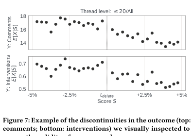

### A.2 阈值操纵检验

回归不连续设计的一个常见威胁是，研究对象可能知道阈值位置，并调整运行变量，使自己落在阈值以下或以上。在本文场景中，这意味着如果用户能在发布前知道自己的评论会得到什么分数，就可能不断改写评论，直到分数低于阈值。作者认为这种威胁在本文场景中并不可信，但仍然进行了标准稳健性检验。

研究者检查了阈值附近分数的密度，并使用 McCrary 检验判断评分变量在阈值处是否存在密度不连续。图 8 展示了分数密度，未显示阈值附近存在操纵迹象；McCrary 检验结果也显示 `p > 0.05`。

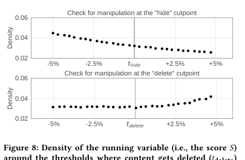

### A.3 安慰剂 FRD 检验

模糊回归不连续设计的关键假设是，在阈值附近，样本除了阈值以上更可能接受处理外，其余方面基本相同。因此，研究中常见做法是选择一个理论上不应受处理影响的变量，重复完整的 FRD 分析。如果阈值上下样本可比，那么这些安慰剂分析不应出现显著差异。

本文使用分配前时期计算同样的结果变量作为安慰剂检验。由于分配前时期尚未发生干预，理论上不应出现结果变量的不连续。表 3 展示了安慰剂 FRD 结果。研究发现，安慰剂分析中的效果很小且不显著，即 `p > 0.05`，说明阈值上下评论具有可比性。

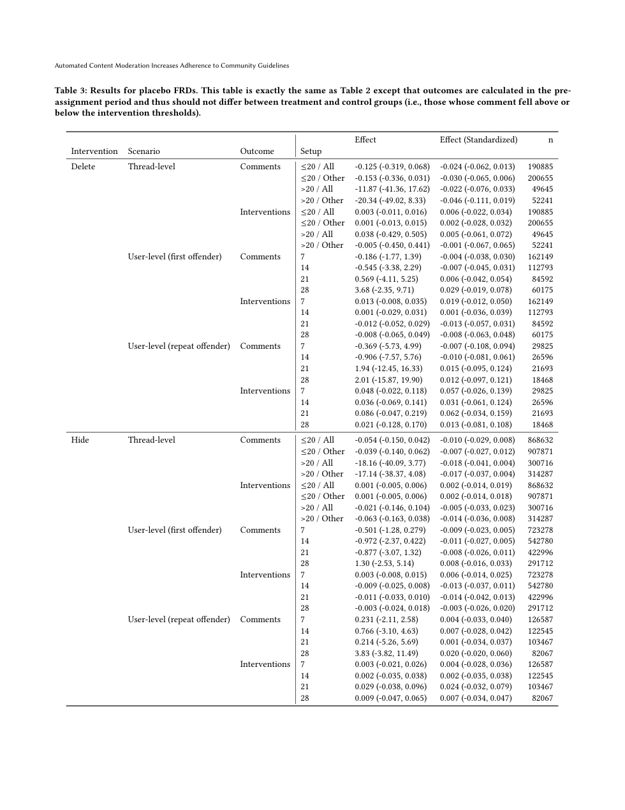

### A.4 改变带宽

最后，为确保结果对核带宽的轻微变化具有稳健性，研究者使用不同带宽重复 FRD 分析。图 9 展示了四个回归不连续设计在 MSE 最优带宽附近变化时，标准化效果如何变化。总体来看，结果对带宽的轻微改变是稳健的。

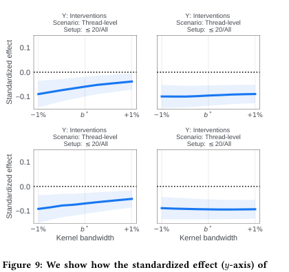

## 译者备注：与毕业设计主题的对应

这篇文献把“分类器评分 S、阈值判断、隐藏/删除干预、用户后续行为变化”连接成一个完整治理闭环。对于基于 AI 评分的内容治理平台而言，它可以作为论文中推荐流、展示控制流和用户画像流的理论支撑：低风险内容进入普通展示，中风险内容降低可见性或进入复核，高风险内容删除或拦截，同时将处理结果回写到用户画像中，作为后续推荐与治理判断的依据。

## 原文出处

[1] Horta Ribeiro M, Cheng J, West R. Automated Content Moderation Increases Adherence to Community Guidelines[A]. In: Proceedings of the ACM Web Conference 2023[C]. New York: Association for Computing Machinery, 2023: 2666-2676. DOI: 10.1145/3543507.3583275.

参考文献列表已略去（见原文）。
