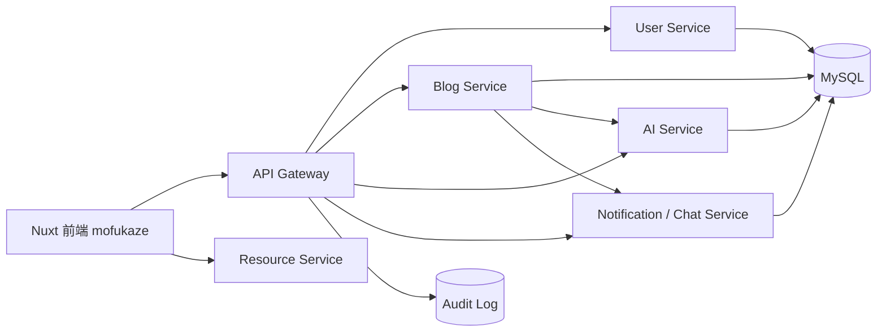
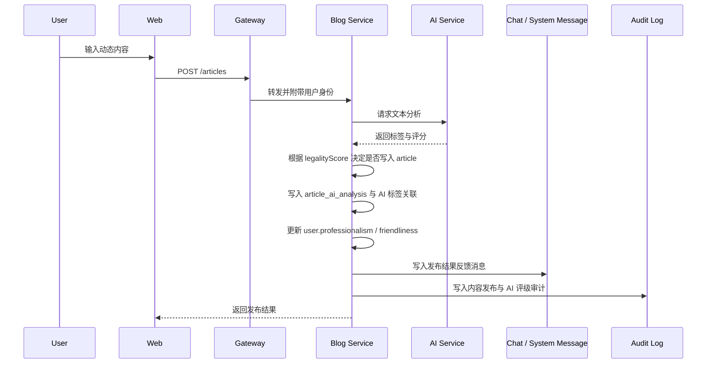

# AI 内容审查微服务社交平台复原路线

本文档用于指导当前本科毕业设计项目的源码复原工作。目标不是机械还原每一行旧代码，而是在保留原有微服务设计思想的基础上，优先恢复一个可演示、可答辩、逻辑闭环完整的版本，再逐步补回历史功能。

当前实施基准已调整为：以云端数据库现有表结构为权威来源，不再参考历史版本记录。具体表结构映射与代码实施顺序见 [基于云端数据库表结构的复原实施计划](cloud-schema-implementation-plan.md)。

## 1. 当前现状判断

### 1.1 项目目标

项目定位为一个类微博的微服务社交平台，核心特色是“用户发布内容前先进入 AI 分析流程”，系统根据大模型给出的标签、风险评分、专业度、友好度等结果，决定内容状态、用户综合评级以及推荐或展示策略。

答辩阶段应优先证明以下闭环：

1. 用户可以注册、登录、退出，并通过角色进行基础权限控制。
2. 用户可以发布文本动态，图片上传可保留普通资源能力，图片 AI 审查暂缓。
3. 内容发布时调用 AI 分析服务，生成标签、风险等级和多维评分。
4. 平台根据分析结果设置内容发布状态，并给用户消息反馈。
5. 系统根据用户历史内容评级生成用户综合行为评级。
6. 内容流或推荐接口能够基于内容风险等级和用户评级做简化展示控制。
7. 关键操作写入安全审计日志，能在答辩中展示可追踪性。

### 1.2 本地仓库残存信息

当前目录结构仍能看出原项目技术栈和服务拆分：

- `mofukaze/`：Nuxt 前端。
- `api_gateway/`：Express + TypeScript API 网关。
- `user_service/`：用户认证与用户资料服务。
- `blog_service/`：内容发布、评论、互动、推荐相关服务。
- `ai_service/`：AI 内容分析服务。
- `chat_service/`：聊天或通知相关服务，可在答辩版本中降级为通知模块。
- `resource_service/`：静态资源服务。
- `docs/`：原文档目录，目前大多数正文被 NUL 字节覆盖。
- `recovered/`：数据恢复得到的少量可读文件。
- `backups/mysql/`：存在备份文件名，但当前 gzip 文件内容疑似也被 NUL 覆盖，暂不作为可靠来源。
- `.history/`：保留了历史文件名和部分小文件，但大量内容也被 NUL 覆盖，只能作为辅助线索。

已观察到的风险：

- 多数 `.ts`、`.vue`、`.md`、`schema.prisma`、`package-lock.json` 文件内容已损坏。
- `recovered/` 中仍有部分可读文件，例如 `recovered/api_gateway/package.json`、`recovered/blog_service/package.json`、`recovered/blog_service/prisma/migrations/*/migration.sql`、`recovered/api_gateway/src/config/routes.ts`。
- 旧文档文件名仍有参考价值，但正文不可直接依赖。
- 本项目后续实施以云端数据库现有表结构为权威来源；本地损坏的 Prisma schema 只作为目录线索，不作为数据模型依据。

### 1.3 复原原则

1. 先封存残骸，再开始重建：不要批量删除 `.history/`、`recovered/`、`backups/` 或损坏的旧文件。
2. 先恢复系统闭环，再追求历史细节：答辩优先级高于逐行还原。
3. 先定接口和数据模型，再写业务代码：微服务项目最怕服务边界混乱。
4. AI 分析先可用、再增强：先用 mock provider 保证演示稳定，再接入 OpenAI-compatible provider。
5. 文档、接口、数据库、代码同步恢复：每一阶段都要留下可答辩材料。

## 2. 推荐目标架构

答辩版本建议保持六个服务，但允许内部实现适当简化。



### 2.1 服务职责

| 服务 | 答辩版本职责 | 可暂缓内容 |
| --- | --- | --- |
| `api_gateway` | 统一入口、鉴权、代理转发、请求 ID、限流、安全审计 | 复杂服务发现 |
| `user_service` | 注册、登录、退出、JWT/cookie、角色、用户综合评级查询 | 复杂后台管理 |
| `blog_service` | 动态发布、查询、删除、关注关系、时间线、简化推荐、内容状态 | 大规模推荐算法 |
| `ai_service` | 文本 AI 分析、标签分类、多维评分、mock 与真实模型适配 | 图片审查 |
| `chat_service` | 消息通知、处理结果反馈，可用 HTTP 轮询实现 | 实时聊天 |
| `resource_service` | 图片等静态资源访问 | 图片 AI 识别 |

## 3. 数据模型复原方案

数据库是复原的“地基”。现在已明确：本地 Prisma 文件已经损坏，云端数据库及其表结构是后续实施的最高优先级。实际代码恢复时，应先通过 `prisma db pull` 从云端库反向生成 schema，再按 [cloud-schema-implementation-plan.md](cloud-schema-implementation-plan.md) 中的表结构映射恢复服务逻辑。

本节保留的是设计层概念说明；具体落地表名以 `user`、`auth_refresh_token`、`article`、`article_ai_analysis`、`article_ai_tag`、`follow`、`reco_*`、`audit_log` 等云端表为准。

### 3.1 用户与权限

建议表：

- `User`
  - `id`
  - `username`
  - `email`
  - `passwordHash`
  - `role`: `USER | ADMIN | REVIEWER`
  - `status`: `ACTIVE | LIMITED | BANNED`
  - `behaviorScore`
  - `behaviorLevel`: `A | B | C | D`
  - `createdAt`
  - `updatedAt`

- `Session` 或直接使用 JWT
  - 答辩版本可只使用 JWT + httpOnly cookie。

### 3.2 社交内容

建议表：

- `Post`
  - `id`
  - `authorId`
  - `content`
  - `imageUrls`，可用 JSON 或单独 `PostImage`
  - `status`: `PENDING | PUBLISHED | NEED_REVIEW | REJECTED | DELETED`
  - `riskScore`
  - `riskLevel`: `LOW | MEDIUM | HIGH | BLOCK`
  - `professionalScore`
  - `friendlinessScore`
  - `qualityScore`
  - `tags`，JSON 存储标签数组
  - `analysisId`
  - `createdAt`
  - `updatedAt`

- `Comment`
  - `id`
  - `postId`
  - `authorId`
  - `content`
  - `createdAt`

- `Follow`
  - `id`
  - `followerId`
  - `followingId`
  - `createdAt`
  - 唯一索引：`followerId + followingId`

### 3.3 AI 分析

建议表：

- `AnalysisResult`
  - `id`
  - `targetType`: `POST`
  - `targetId`
  - `userId`
  - `contentHash`
  - `provider`
  - `model`
  - `riskScore`
  - `riskLevel`
  - `professionalScore`
  - `friendlinessScore`
  - `qualityScore`
  - `tags`
  - `reason`
  - `suggestion`
  - `rawResponse`
  - `createdAt`

- `TagTaxonomy`
  - `id`
  - `code`
  - `name`
  - `parentCode`
  - `description`
  - `enabled`

答辩阶段也可以将标签库写成 `ai_service/src/services/tagTaxonomy.ts` 的常量数组，数据库只存分析结果。

### 3.4 用户行为评级

建议表：

- `UserBehaviorStat`
  - `userId`
  - `postCount`
  - `highRiskCount`
  - `rejectedCount`
  - `avgRiskScore`
  - `avgProfessionalScore`
  - `avgFriendlinessScore`
  - `behaviorScore`
  - `behaviorLevel`
  - `updatedAt`

评分规则建议先采用可解释公式：

```text
behaviorScore = clamp(
  100
  - avgRiskScore * 0.55
  - rejectedCount * 6
  - highRiskCount * 3
  + avgProfessionalScore * 0.15
  + avgFriendlinessScore * 0.15,
  0,
  100
)

A: 85-100
B: 70-84
C: 50-69
D: 0-49
```

### 3.5 通知与审计

建议表：

- `Notification`
  - `id`
  - `userId`
  - `type`: `POST_RESULT | INTERACTION | SYSTEM`
  - `title`
  - `content`
  - `payload`
  - `readAt`
  - `createdAt`

- `AuditLog`
  - `id`
  - `requestId`
  - `actorId`
  - `action`
  - `targetType`
  - `targetId`
  - `decision`
  - `metadata`
  - `ip`
  - `userAgent`
  - `createdAt`

## 4. AI 内容评级闭环设计

### 4.1 AI 服务输入

`POST /analysis/text`

```json
{
  "userId": 1,
  "targetType": "ARTICLE",
  "targetId": 1001,
  "content": "用户发布的文本内容"
}
```

### 4.2 AI 服务输出

```json
{
  "friendlinessScore": 86,
  "rationalityScore": 80,
  "legalityScore": 92,
  "professionalismScore": 78,
  "tags": [
    { "name": "日常生活", "confidence": 0.91, "weight": 1.0 },
    { "name": "温和观点", "confidence": 0.72, "weight": 0.7 }
  ],
  "reason": "内容表达正常，无明显攻击性或违规风险。",
  "suggestion": "可以直接发布。"
}
```

### 4.3 内容状态策略

建议用清晰阈值，便于答辩解释：

| `legalityScore` | 运行时风险等级 | 写入决策 | 展示策略 |
| --- | --- | --- | --- |
| `80-100` | `LOW` | 写入 `article` | 正常展示 |
| `60-79` | `MEDIUM` | 写入 `article` | 降低推荐权重 |
| `40-59` | `HIGH` | 第一轮可拒绝写入 | 不进入公开推荐 |
| `0-39` | `BLOCK` | 拒绝写入 `article` | 只写审计与反馈 |

### 4.4 发布流程



### 4.5 AI Provider 策略

复原阶段建议实现两个 provider：

1. `mockProvider`
   - 无需网络和密钥。
   - 根据关键词、长度、标点密度生成稳定评分。
   - 用于答辩兜底，保证现场演示不会因模型接口失败中断。

2. `openaiCompatibleProvider`
   - 通过环境变量配置：
     - `AI_PROVIDER=openai-compatible`
     - `AI_BASE_URL`
     - `AI_API_KEY`
     - `AI_MODEL`
   - 要求模型只输出 JSON。
   - 解析失败时降级为 `NEED_REVIEW`，同时记录错误审计。

## 5. 分阶段复原路线

### 阶段 0：冻结现场与建立清单

目标：防止二次损坏，并知道哪些文件仍可用。

任务：

1. 复制当前工作区到只读备份目录。
2. 生成文件健康清单：路径、大小、NUL 字节比例、是否可读。
3. 单独记录可读文件：
   - `recovered/api_gateway/package.json`
   - `recovered/blog_service/package.json`
   - `recovered/blog_service/prisma/migrations/*/migration.sql`
   - `recovered/api_gateway/src/config/routes.ts`
   - 少量 `dist/` 与 `.history/` 中可读文件
4. 记录云端数据库连接信息、表结构导出文件和本地可读残骸，后续不依赖历史版本记录判断项目来源。

验收：

- 得到 `docs/recovery-inventory.md` 或脚本输出。
- 明确哪些文件可以直接移植，哪些必须重写。

### 阶段 1：重建工程骨架

目标：恢复可安装、可编译、可运行的 TypeScript 多服务骨架。

任务：

1. 为每个服务重写 `package.json`、`tsconfig.json`、`Dockerfile`。
2. 删除或隔离损坏的 `package-lock.json` 后重新安装依赖并生成锁文件。
3. 重写根目录 `docker-compose.dev.yml`：
   - MySQL
   - `api_gateway`
   - `user_service`
   - `blog_service`
   - `ai_service`
   - `chat_service`
   - `resource_service`
   - `mofukaze`
4. 统一端口和服务名：
   - gateway: `3000`
   - user: `3003`
   - blog: `3002`
   - ai: `3004`
   - chat/notification: `3005`
   - frontend: `3001`

验收：

- 每个服务都有 `/health`。
- `docker compose -f docker-compose.dev.yml up` 能启动基础服务。

### 阶段 2：基于云端库重建 Prisma

目标：把云端数据库的权威表结构反向生成可用 Prisma schema，并生成客户端。

任务：

1. 为各服务建立最小 `schema.prisma`，配置 MySQL datasource。
2. 使用云端 `DATABASE_URL` 执行 `npx prisma db pull`。
3. 执行 `npx prisma generate` 生成客户端。
4. 将反向生成的 schema 保存为基线，后续按 `@@map` / `@map` 整理命名。
5. 第一轮不对云端库执行破坏性迁移；本地开发库可用 `prisma db push` 建测试环境。
6. 以 `user`、`auth_refresh_token`、`article`、`article_ai_analysis`、`article_ai_tag*`、`follow`、`reco_*`、`audit_log` 等现有表恢复服务逻辑。

验收：

- `npx prisma generate` 成功。
- 能通过 Prisma 查询云端或本地测试库中的 `user`、`article`、`article_ai_analysis`。
- 本地测试库可以创建测试用户、关注关系和示例内容。

### 阶段 3：用户认证与权限模块

目标：先恢复所有后续功能依赖的身份系统。

接口建议：

- `POST /auth/register`
- `POST /auth/login`
- `POST /auth/logout`
- `GET /auth/me`
- `GET /users/:id`
- `GET /users/:id/rating`
- `PATCH /admin/users/:id/status`

实现要点：

1. 密码使用 `bcrypt` 哈希。
2. JWT 放入 httpOnly cookie，网关和服务端都能解析用户身份。
3. 角色至少包含 `USER`、`ADMIN`、`REVIEWER`。
4. 所有登录、失败登录、权限拒绝都写审计日志。

验收：

- 普通用户无法访问管理员接口。
- 登录后能发布内容，退出后无法发布。

### 阶段 4：AI 服务

目标：恢复项目创新点，先保证稳定输出，再接入真实模型。

接口建议：

- `POST /analysis/text`
- `GET /analysis/:id`
- `GET /taxonomy/tags`

实现要点：

1. 固定输出 JSON schema。
2. 标签库采用分层 code，例如：
   - `life.daily`
   - `tech.ai`
   - `education.study`
   - `opinion.mild`
   - `risk.insult`
   - `risk.spam`
   - `risk.illegal`
3. 分数统一为 `0-100`。
4. provider 失败时返回保守结果：`legalityScore=40`，发布接口按高风险处理并写入审计。

验收：

- mock provider 可离线稳定运行。
- 同一段文本能得到标签、多维评分、风险等级。
- 原始响应和解析结果可以追溯。

### 阶段 5：内容发布与管理

目标：恢复核心业务闭环。

接口建议：

- `POST /articles`
- `GET /articles/:id`
- `GET /articles`
- `DELETE /articles/:id`
- `GET /timeline`
- `POST /articles/:id/comments`
- `GET /articles/:id/comments`

实现要点：

1. 创建内容时先保存 `PENDING`。
2. 同步调用 AI 服务；答辩版本建议先同步实现，便于演示。
3. 根据 AI 结果更新内容状态。
4. 内容结果写通知。
5. 发布、删除、AI 决策写审计。
6. 查询接口默认只返回已写入 `article` 且 `legalityScore` 达到展示阈值的内容。

验收：

- 低风险内容直接发布。
- 高风险内容进入审核或拒绝。
- 用户能看到发布结果通知。

### 阶段 6：关注关系与时间线

目标：恢复类微博体验。

接口建议：

- `POST /users/:id/follow`
- `DELETE /users/:id/follow`
- `GET /users/:id/followers`
- `GET /users/:id/following`
- `GET /timeline/following`

实现要点：

1. `Follow` 表只存用户 ID，不跨服务做强外键。
2. 时间线先按关注用户 + 自己的内容倒序返回。
3. 只展示已通过 AI 阈值并写入 `article` 的内容。
4. `MEDIUM` 风险内容保留展示，但根据 `legalityScore` 降低排序权重或标记为低优先级。

验收：

- A 关注 B 后，A 的关注流能看到 B 的已发布内容。
- 取消关注后不再出现在关注流。

### 阶段 7：通知与反馈

目标：让 AI 处理结果对用户可见。

接口建议：

- `GET /chat/system`
- `GET /chat/threads/:id/messages`
- `POST /chat/threads/:id/messages`

实现要点：

1. 当前表结构没有独立通知表，第一轮用 `chat_thread` / `chat_message` 兼任系统通知。
2. 发布成功、拒绝发布、降权展示等结果写入系统消息。
3. 评论、互动可先通过接口响应反馈，后续再扩展通知表或已读状态。

验收：

- 发布内容后立刻能在系统消息页看到 AI 分析结果摘要。

### 阶段 8：推荐与展示控制

目标：保留评级机制的存在感，避免陷入复杂推荐算法。

简化策略：

1. 推荐候选来自 `article`，并关联 `article_ai_analysis`。
2. `legalityScore >= 80` 的内容权重最高，`60-79` 的内容权重降低。
3. `legalityScore < 60` 的内容不进入公开推荐。
4. 作者 `user.professionalism` 与 `user.friendliness` 越高，内容权重略微提高。
5. 推荐请求和结果写入 `reco_request_log`，曝光、点击、点赞等行为写入 `reco_event`。

验收：

- 接口返回内容时能说明每条内容的展示决策。
- 审计日志记录推荐过滤原因。

### 阶段 9：前端恢复

目标：恢复答辩演示路径，不追求全部旧 UI。

页面优先级：

1. 登录 / 注册页。
2. 首页时间线。
3. 发布动态页。
4. 内容详情页。
5. 用户主页与用户评级展示。
6. 系统消息页。
7. 管理或审核页。

演示路径：

1. 注册或登录用户。
2. 发布一条低风险内容，展示 AI 标签和评分。
3. 发布一条高风险内容，展示被拦截或进入审核。
4. 查看通知中心。
5. 查看用户综合行为评级变化。
6. 管理员查看审计日志或审核列表。

验收：

- 不依赖浏览器控制台操作。
- 每个核心功能都有界面入口。

### 阶段 10：测试、答辩材料与备份

目标：把系统变成能稳定展示的毕业设计成果。

测试清单：

- 认证：注册、登录、退出、未登录拒绝。
- 权限：普通用户访问管理员接口被拒绝。
- 内容：低风险发布、高风险拦截、删除权限。
- AI：mock provider、真实 provider、解析失败降级。
- 用户评级：发布多条不同风险内容后分数变化。
- 推荐：不同风险等级内容展示策略不同。
- 审计：关键行为均有日志。

答辩材料：

- 系统架构图。
- 数据库 ER 图。
- 内容发布时序图。
- AI 分析 JSON 示例。
- 用户评级公式。
- 推荐展示策略表。
- 演示脚本。
- 测试截图和接口结果。

备份策略：

1. 每完成一个阶段，压缩备份当前项目目录。
2. 每天导出云端数据库 schema 和必要 seed 数据。
3. 将文档、源码、数据库结构导出文件同步到 Windows 普通目录和云盘。
4. 代码恢复稳定后，再按需要建立新的版本管理记录；历史记录不参与本项目复原判断。

## 6. 推荐恢复顺序

最短答辩路径：

1. `docs/project-recovery-plan.md`
2. 根目录工程配置与 Docker Compose
3. 从云端库 `prisma db pull` 重建 Prisma schema 与 seed
4. `user_service`
5. `ai_service`
6. `blog_service`
7. `api_gateway`
8. `chat_service` 降级通知模块
9. `mofukaze` 演示页面
10. 测试文档与答辩讲稿

不要先做的事：

- 不先恢复图片 AI 审查。
- 不先做复杂推荐算法。
- 不先纠结历史 UI 的每个细节。

## 7. 下一步行动建议

建议下一步先做“阶段 0 + 阶段 1”的实际落地：

1. 生成 `docs/recovery-inventory.md`，列出可读文件和损坏文件。
2. 用 `recovered/` 中可读 package 与现有目录名重建每个服务的 `package.json`。
3. 按云端数据库表结构执行 `prisma db pull`，生成新的 Prisma schema。
4. 先实现所有服务 `/health`，让微服务骨架跑起来。

只要服务骨架跑通，后续就能按“认证 -> AI -> 内容发布 -> 用户评级 -> 通知 -> 展示控制”的顺序稳步恢复。这个项目的骨架没有死，只是源码文本层面被打碎了；按闭环重建，比试图从空字节里硬挖旧代码更可控。
