# 系统核心链路、数据库结构与图示文档

本文档用于毕业设计答辩、论文 ER 图、流程图、数据模型图和总体结构图整理。当前系统名义上采用微服务结构，但数据库暂未拆分，各服务共享同一个 MySQL 数据库。图示按“服务职责边界”划分表归属，既贴合当前实现，也便于后续扩展为独立数据库。

## 1. 核心功能链路

### 1.1 总体业务闭环

系统的主链路是：

```text
用户注册/登录
  -> 发布内容
  -> AI 静默分析内容
  -> 写入文章、评分、标签
  -> 进入首页/关注流/标签页/推荐流
  -> 用户评论、reaction、关注、私聊
  -> 产生推荐事件与通知
  -> 更新用户兴趣画像与综合评分
  -> 审计日志沉淀
  -> 管理员监控平台汇总运行状态
```

其中 AI 审查是后台静默过程，不作为普通用户主动感知的功能出现。普通用户可看到内容标签、评分结果或展示排序变化，但不会收到“正在 AI 审查”的显性通知。管理员可以通过运营监控和审计日志查看系统处理结果。

### 1.2 模块与数据表归属

| 模块 | 服务 | 核心职责 | 主要数据表 |
| --- | --- | --- | --- |
| 用户认证与权限 | `user_service` | 注册、登录、刷新令牌、角色权限、用户综合评分 | `user`, `auth_refresh_token`, `audit_log` |
| 内容发布与互动 | `blog_service` | 文章、评论、emoji reaction、关注、时间线、标签页 | `article`, `comment`, `article_reaction`, `comment_reaction`, `follow`, `article_tag`, `article_tag_on_article` |
| AI 内容分析 | `ai_service` | 文本评分、AI 标签分类、风险与质量数据持久化 | `article_ai_analysis`, `article_ai_tag`, `article_ai_tag_on_article` |
| 推荐与画像 | `blog_service` | 曝光/点击/互动事件、用户兴趣向量、展示优先级 | `reco_event`, `reco_request_log`, `reco_user_profile`, `reco_user_seen`, `reco_article_daily_stat` |
| 通知中心 | `blog_service` | 发布结果、评论、回复、reaction、关注通知 | `notification` |
| 私信聊天 | `chat_service` | 单对单 WebSocket 聊天、历史消息、emoji 文本消息 | `chat_thread`, `chat_message` |
| 网关与审计监控 | `api_gateway` | 统一 `/api` 前缀、服务路由、健康检查、管理员汇总 | `audit_log` |

> 注：`notification` 是当前恢复阶段由 `blog_service` 启动时自动创建的运行期表，尚未写入 Prisma schema。论文中可以将其作为“通知中心表”纳入 ER 图；工程上后续可补 Prisma migration。

## 2. 分模块 ER 图

### 2.1 用户认证与权限模块 ER 图

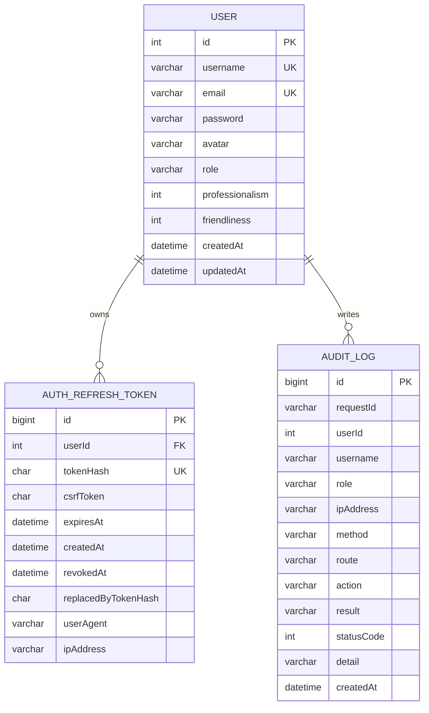

说明：

- `user.role` 控制普通用户、审核员、管理员的接口访问权限。
- `user.professionalism` 与 `user.friendliness` 是用户综合行为评级结果，可参与推荐和展示排序。
- `auth_refresh_token` 保存刷新令牌哈希和 CSRF token，支持登录状态续期与退出失效。
- `audit_log` 是跨服务共享审计表，各服务按请求写入关键行为。

### 2.2 内容、评论、reaction 与标签模块 ER 图

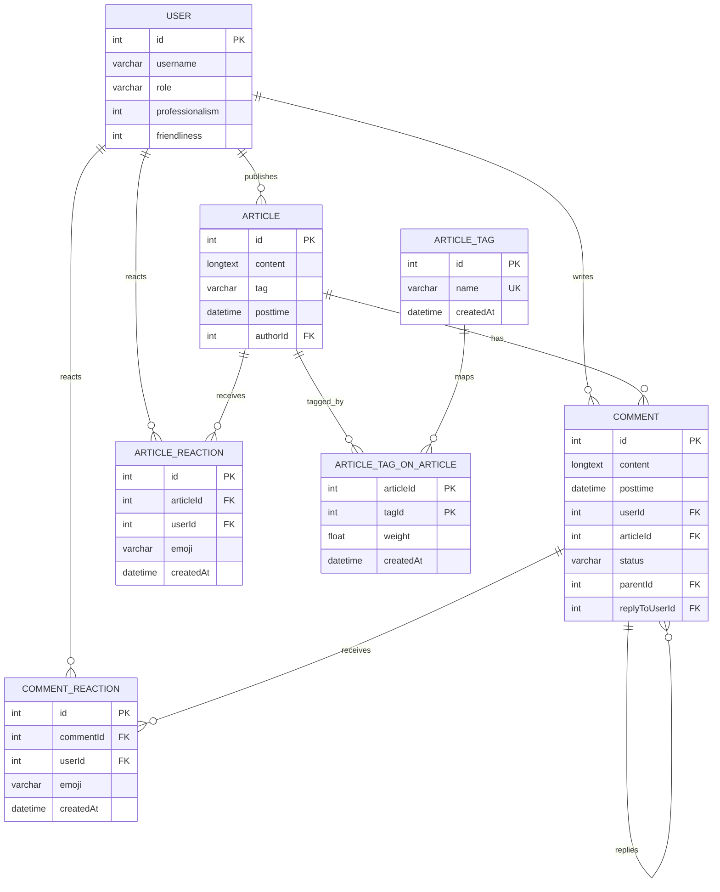

说明：

- `article.tag` 保留一个主标签字段，便于兼容旧逻辑和快速展示。
- `article_tag` / `article_tag_on_article` 表示人工或系统基础标签。
- 文章和评论都支持 emoji reaction，并通过唯一约束避免同一用户重复提交同一 emoji。
- `comment.parentId` 和 `replyToUserId` 支持楼中楼回复与被回复用户定位。

### 2.3 AI 内容分析模块 ER 图

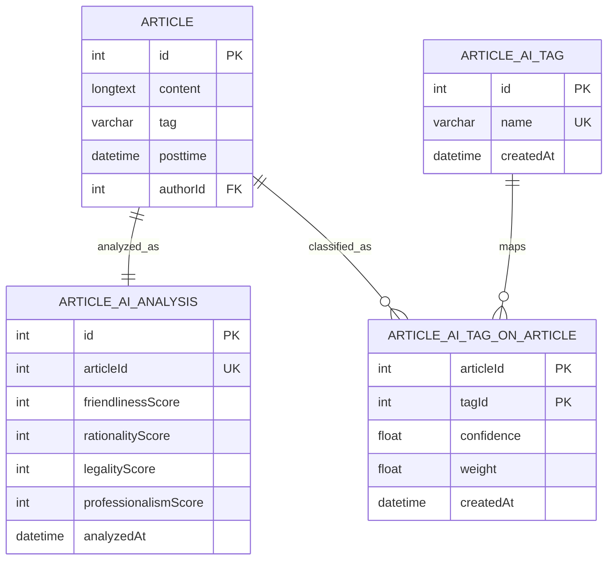

说明：

- AI 分析在文章发布阶段自动执行。
- 评分维度包括友好度、理性度、合法性、专业度。
- AI 标签库设计目标是 50 个大类、约 300 个子标签，分析结果以 JSON 结构解析后写入 `article_ai_tag` 与关联表。
- `confidence` 表示模型对标签判断的置信度，`weight` 表示该标签在当前文章中的推荐权重。

### 2.4 关注、通知与社交反馈模块 ER 图

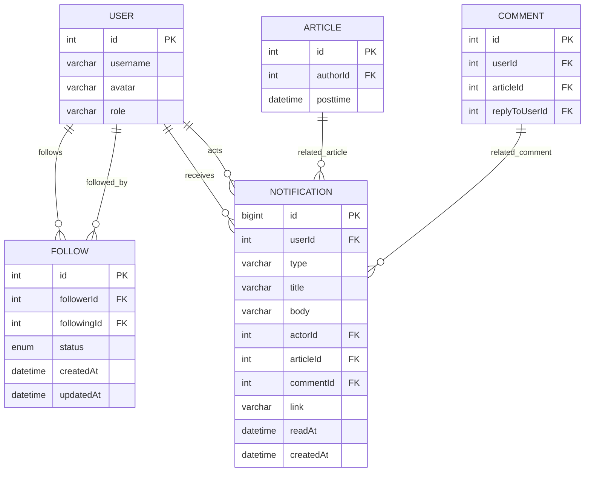

说明：

- `follow.status` 使用 `ACTIVE`、`BLOCKED`、`REMOVED` 表达关注关系生命周期。
- `notification.type` 当前包括：`CONTENT_PUBLISHED`、`COMMENT`、`REPLY`、`ARTICLE_REACTION`、`COMMENT_REACTION`、`FOLLOW`。
- 通知中心服务普通互动反馈，不承担 AI 审查显性提示，避免让用户感知审查流程过重。

### 2.5 推荐、画像与展示控制模块 ER 图

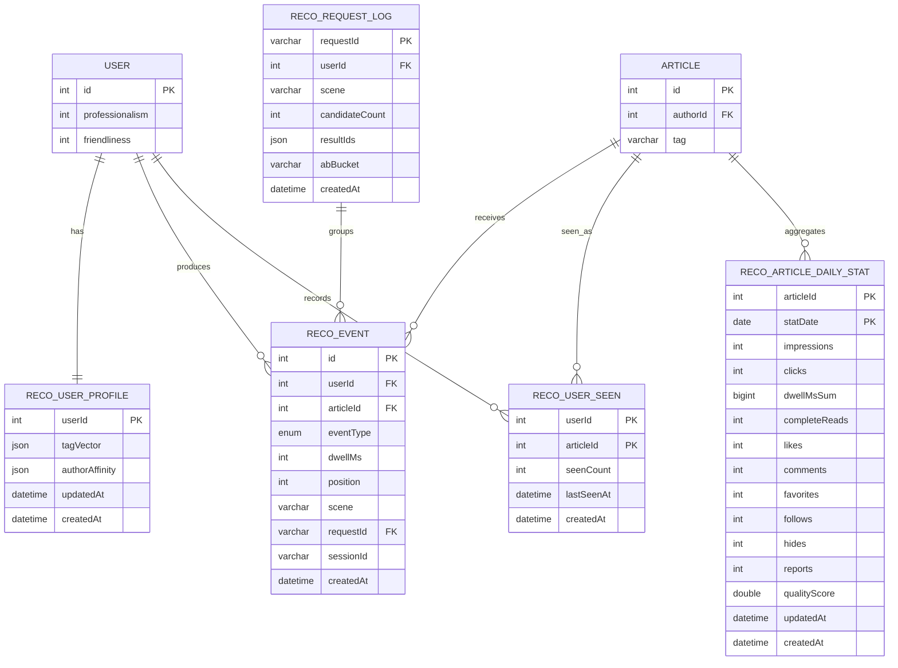

说明：

- `reco_event` 记录曝光、点击、停留、点赞、评论、关注作者、隐藏、举报等用户行为。
- `reco_user_profile.tagVector` 基于 AI 标签和用户行为生成兴趣向量。
- `reco_article_daily_stat.qualityScore` 聚合文章每日质量数据。
- 推荐排序同时参考内容 AI 评分、用户兴趣向量、作者亲和度和用户综合评分。

### 2.6 单对单聊天模块 ER 图

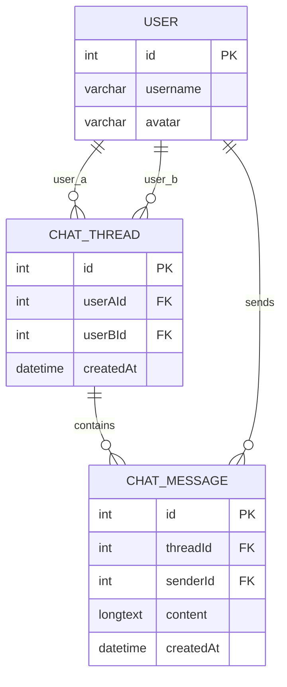

说明：

- `chat_thread` 通过 `userAId` 与 `userBId` 表示一个固定的单对单会话。
- `chat_message.content` 保存文本内容，emoji 作为普通 Unicode 字符写入消息文本。
- WebSocket 负责实时推送，REST 接口负责会话列表、历史消息和用户搜索。

### 2.7 审计与管理员监控模块 ER 图

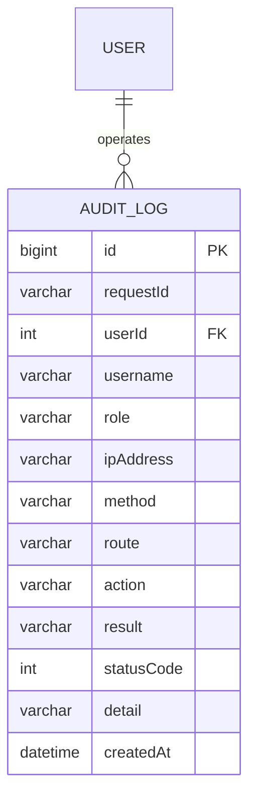

说明：

- `audit_log` 是所有服务的统一审计沉淀表。
- 管理员监控平台基于 `audit_log` 聚合最近时间窗口内的成功率、失败率、热点接口、失败请求。
- `api_gateway` 还会提供服务健康状态和路由指标，作为运维面板的数据来源。

## 3. 关键业务流程图

### 3.1 用户认证流程

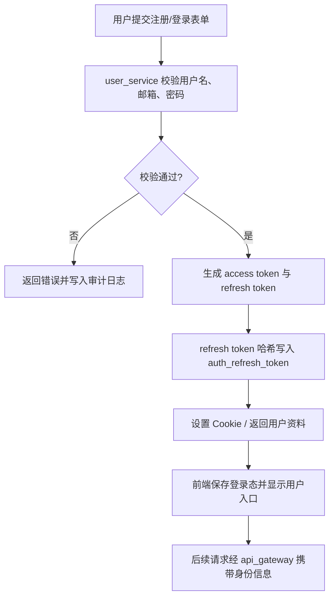

### 3.2 内容发布与 AI 静默分析流程

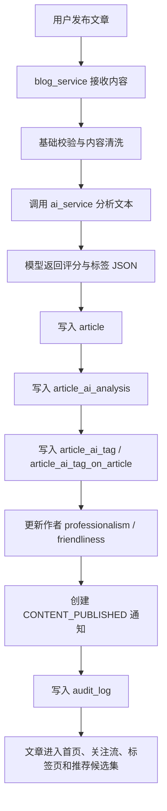

### 3.3 推荐展示与行为反馈流程

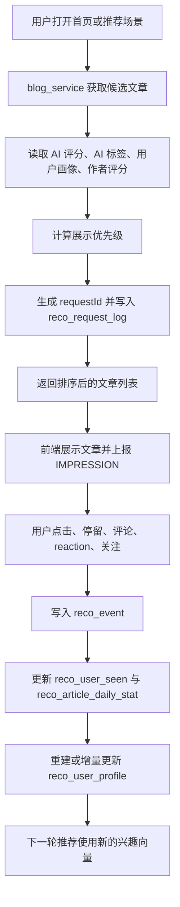

### 3.4 评论、reaction 与通知流程

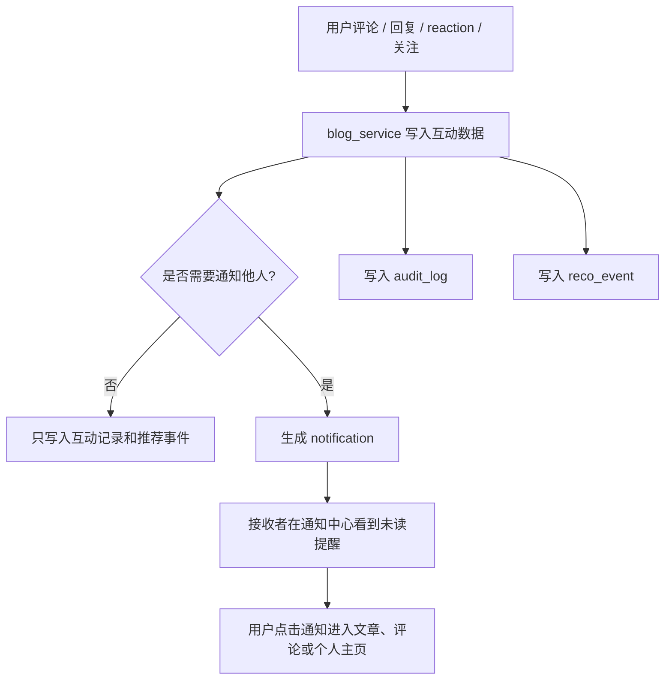

### 3.5 关注时间线流程

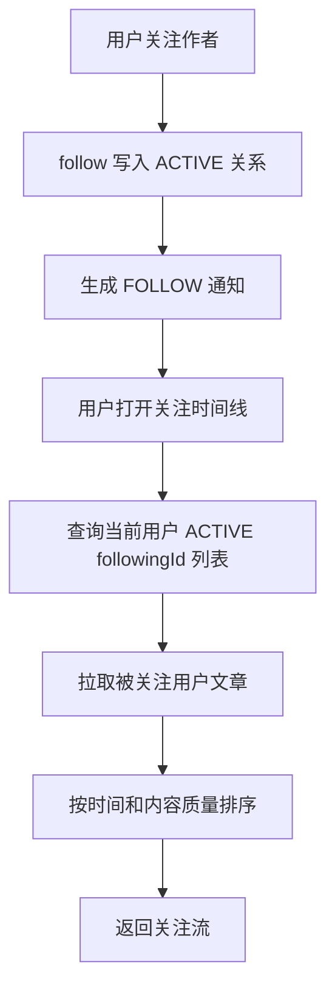

### 3.6 单对单聊天流程

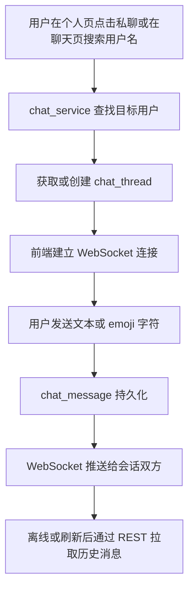

### 3.7 管理员监控流程

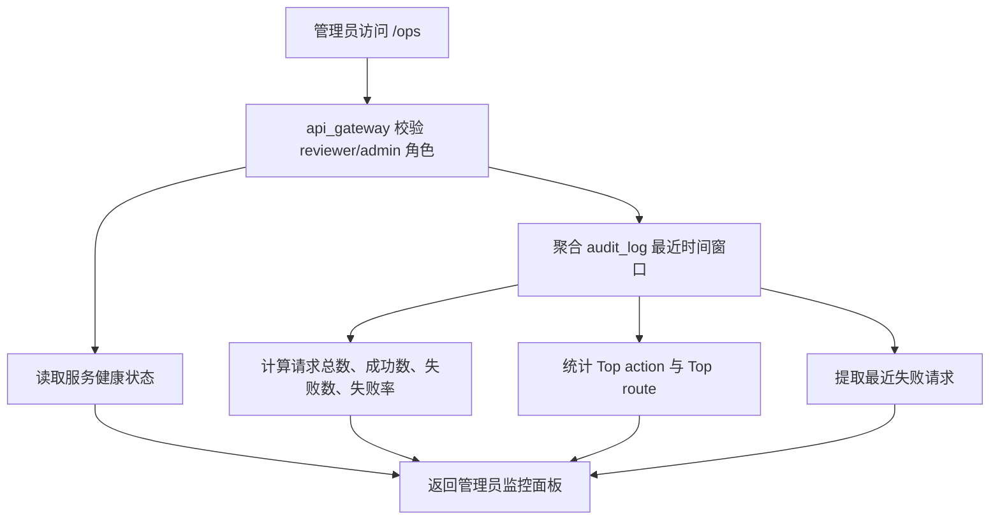

## 4. 数据模型图

### 4.1 内容质量数据模型

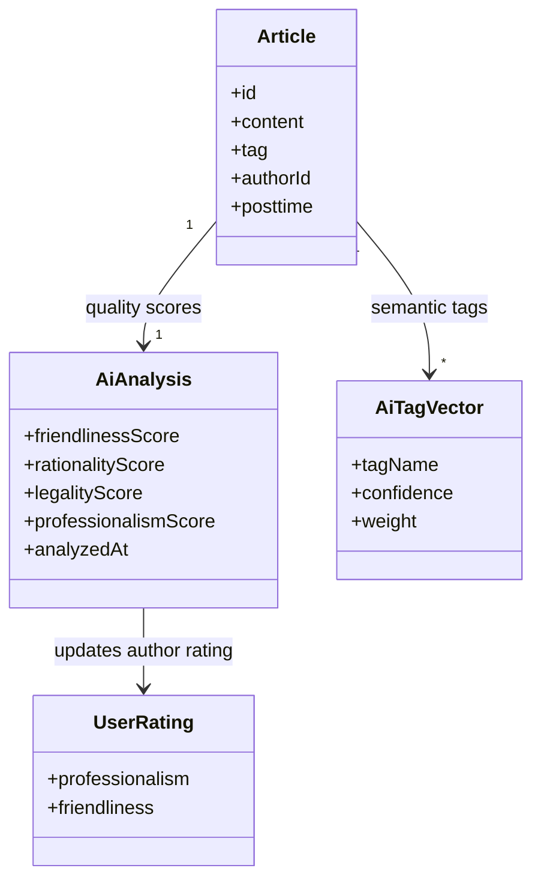

含义：

- 文章是 AI 分析的输入载体。
- `AiAnalysis` 记录内容质量评分。
- `AiTagVector` 记录标签分类结果。
- 作者综合评分由历史内容质量聚合而来。

### 4.2 推荐画像数据模型

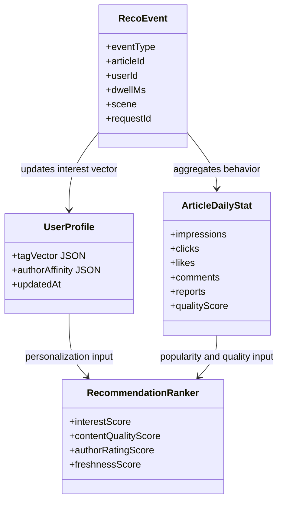

含义：

- 用户行为首先进入 `reco_event`。
- 行为数据同时更新用户画像和文章每日统计。
- 推荐排序器综合兴趣、质量、作者评分和时间新鲜度生成展示顺序。

### 4.3 通知事件数据模型

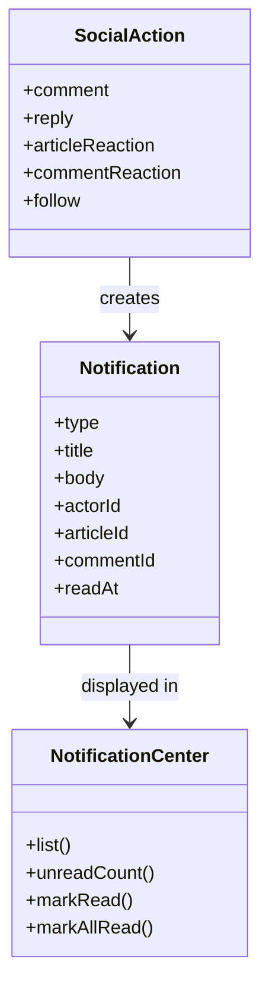

含义：

- 通知来自明确的社交动作或发布结果。
- AI 审查不作为通知来源，保持静默治理边界。
- 通知中心只负责用户可理解的结果反馈和互动提醒。

## 5. 总体结构图

### 5.1 微服务运行结构图

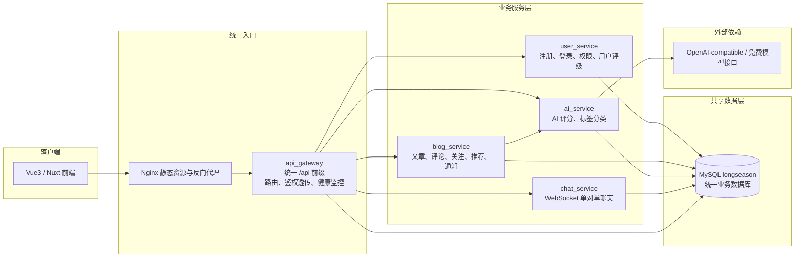

### 5.2 数据流总体结构图

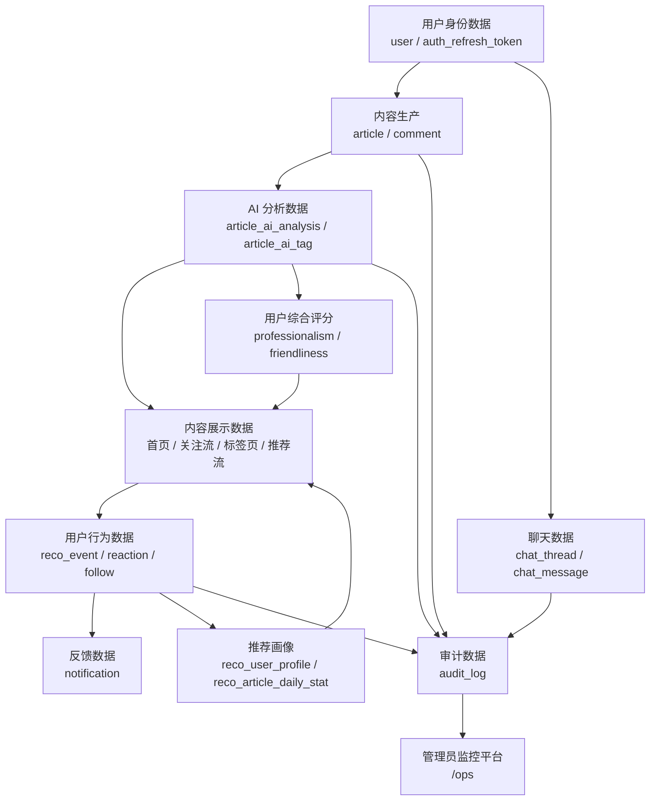

## 6. 可用于论文的图表拆分建议

论文正文中建议不要一次放入全部表结构，可以按章节拆分：

1. 系统总体架构图：使用“5.1 微服务运行结构图”。
2. 数据库总体关系说明：使用“5.2 数据流总体结构图”。
3. 用户与权限模块 ER 图：使用“2.1 用户认证与权限模块 ER 图”。
4. 内容与互动模块 ER 图：使用“2.2 内容、评论、reaction 与标签模块 ER 图”。
5. AI 内容评级模块 ER 图：使用“2.3 AI 内容分析模块 ER 图”。
6. 推荐与用户画像模块 ER 图：使用“2.5 推荐、画像与展示控制模块 ER 图”。
7. 通知中心模块 ER 图：使用“2.4 关注、通知与社交反馈模块 ER 图”中的通知部分。
8. 私信模块 ER 图：使用“2.6 单对单聊天模块 ER 图”。
9. 业务流程图：使用“3.2 内容发布与 AI 静默分析流程”和“3.3 推荐展示与行为反馈流程”。
10. 管理员监控流程图：使用“3.7 管理员监控流程”。

## 7. 当前实现边界与后续可扩展点

当前已经形成闭环的部分：

- 注册、登录、刷新令牌、角色权限。
- 文章发布、AI 静默评分、AI 标签落库。
- 首页、关注流、标签页、推荐流展示。
- 评论、回复、文章 reaction、评论 reaction、关注。
- 推荐事件写入、用户兴趣画像、展示优先级调整。
- 单对单 WebSocket 私信与 emoji 文本发送。
- 通知中心与未读提醒。
- 审计日志与管理员监控面板。

后续可扩展但不影响毕业设计闭环的部分：

- 将 `notification` 表纳入 Prisma schema 和正式 migration。
- 将单库模式拆分为用户库、内容库、推荐库、聊天库。
- 增加图片上传与图片内容分析。
- 增加举报、隐藏、收藏的前端入口。
- 增加 WebSocket 自动重连、离线消息提示和消息已读状态。
